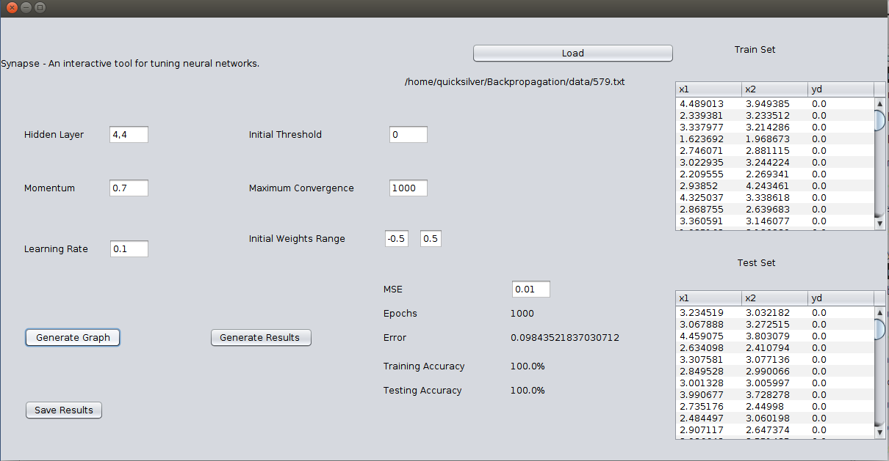
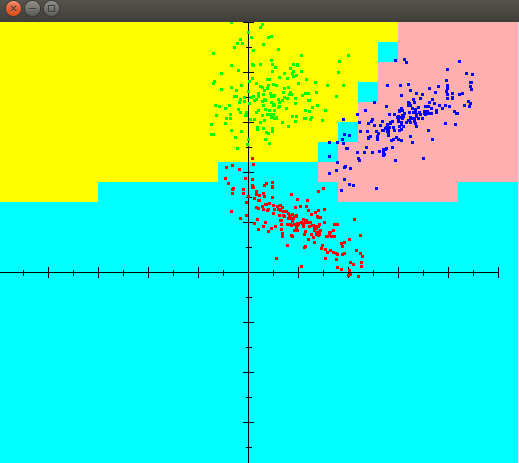

# Synapse
An interactive tool for tuning the hyperparameters of a neural network.

## Dependencies 

* java version "1.8.0_191"
* Netbeans IDE 8.1

## To run the project
```
cd dist
ja -jar Synapse.jar
```
## GUI



